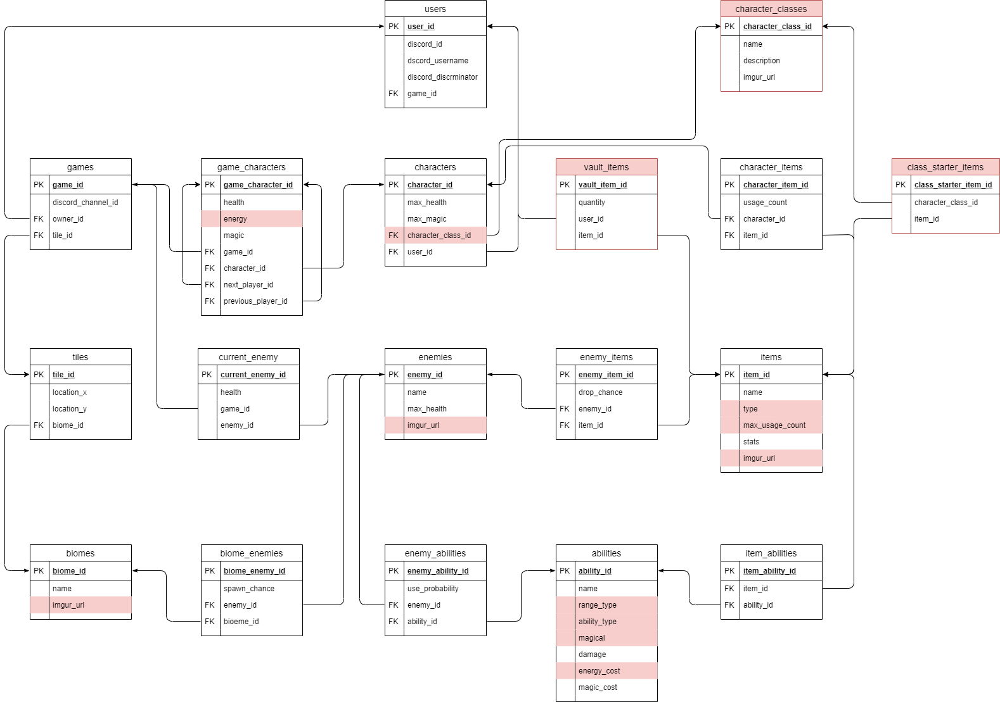

# 🐉 Dungeons And Discords
Dungeons and Discords is a turn based game playable in any discord server. The project currently has a basic turn based system, and will later implement an action point system similar to dungeons and dragons. The project is built using a Ruby on Rails GraphQL API and Typescript using the Discord.js library.

# Screenshots
<a href="https://gyazo.com/b44bf6b6e213e507234dafcd30c0d3aa"></a>

# Schema
</img>

# Setup
This bot requires both the bot and api to succesfully work. There will later be a docker-compose file to initiate the setup.

```
npm run dev
rails s
```
